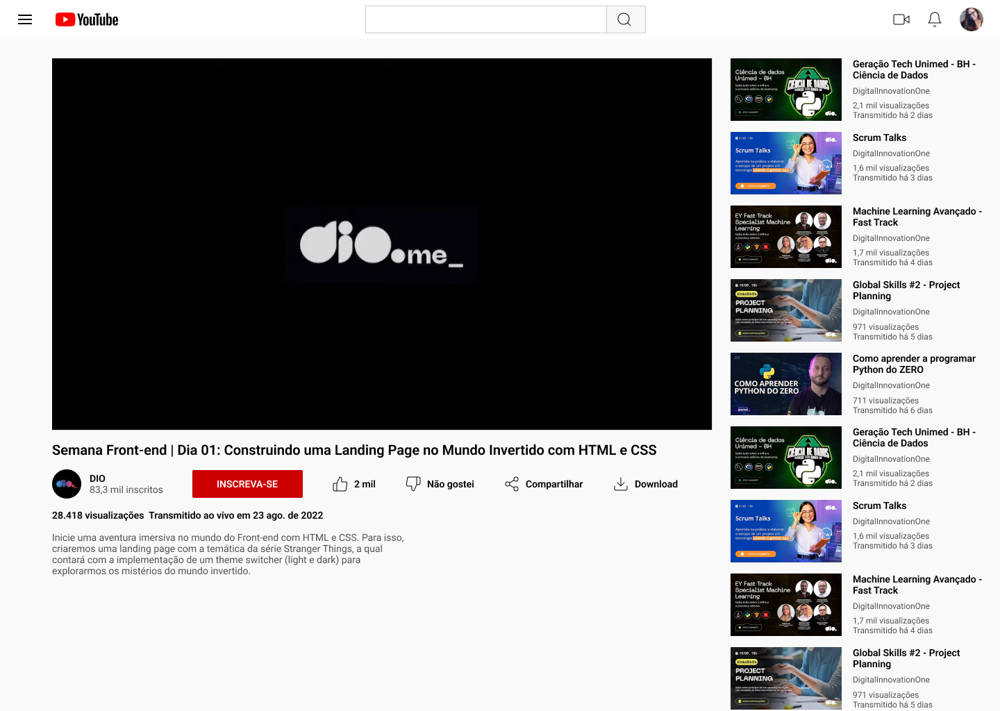

# Desafio 02: Clonando a página do YouTube utilizando o Flexbox

Neste desafio foi desenvolvido uma página estática do YouTube com base no layout abaixo, utilizando os conhecimentos de Flexbox aprendidos ao longo da segunda parte da formação CSS da DIO.

